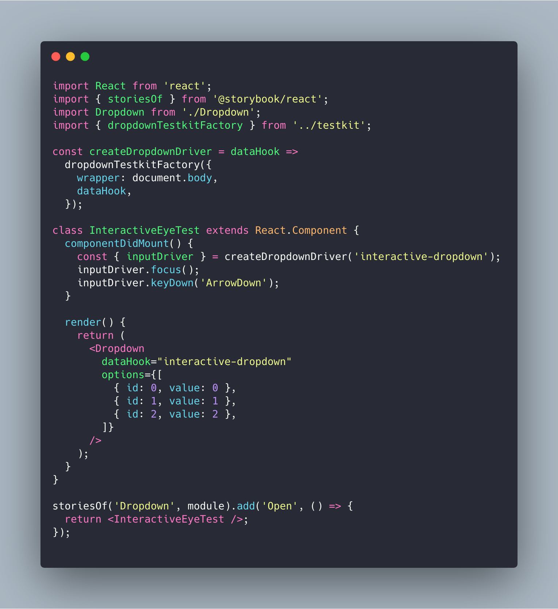

# Visual testing becomes trivial with **`eyes-storybook`**

## Terminology

- `storybook` - a playground to display (React) components with a navigation sidebar.
- `visual-grid` - Applitools' service making visual comparison in the cloud in a fast and efficient way.
- `eyes-strorybook` - Applitool’s tool to make visual testing in `storybook` with `visual-grid`.

## `visual-grid` vs. traditional screenshot comparison

Applitools offers their well known service of screenshot comparison. You open a browser, run a test, take a screenshot and send to Applitools’ service in a sequential order to compare it with the baseline.

It works fine but has few downsides:

1. Taking screenshot network request is slow.
2. Uploading a screenshot is sequential, meaning a test isn't done before the image verification is done.
3. Screenshots must be taken from the same device because every machine renders differently. This means that visual tests are running only on CI.

The `visual-grid` solution, takes static **HTML** and **CSS** assets from a page and send them in parallel to Applitools.
This means tests are **much faster** and also **runs locally**

## How do we use `eyes-storybook`?

Simply create a new file `MyComponent/tests/MyComponent.visual.js`:

```jsx
import React from 'react';
import { storiesOf } from '@storybook/react';
import MyComponent from ‘../‘;

storiesOf('MyComponent/size', module)
  .add('large', () => (
    <MyComponent size="large" />
  )
);
```

And that’s it!

During the test phase of our build process, we run `npm run test:eyes-storybook` which does all the testing heavy-lifting.

## What do we test in visual tests?

1. Default rendering
2. Props variations, for example: size, skin, error message, etc…
3. Simple interactions like clicking on dropdowns.

## How do I test interactions?

There are no specific best practices yet, but here’s an example:
.

It’s like running a test in the browser, using our drivers.

## What can’t be tested with `eyes-storybook`?

1. Interactions which are not immediate, like animations, can cause flaky tests.
2. Asynchronous actions, like waiting for tooltip to appear (it’s still a WIP in Applitools).

See [#3304](https://github.com/wix/wix-style-react/issues/3304)

## Can I run tests locally?

Yes you can!
Simply create a file called `applitools.private.config.js` (on the root level) and add our API key:

```js
module.exports = {
  apiKey: 'INTERNAL_KEY_SO_ASK_THE_TEAM'
};
```

## How can I debug a component rendered into a snapshot?

Just run `npm run eyes-storybook-debug`. This will open the tests storybook and navigate between pages.

## Is there a good example to see?

Take a look at the `AddItem` visual [test file](https://github.com/wix/wix-style-react/blob/master/src/AddItem/tests/AddItem.visual.js).
